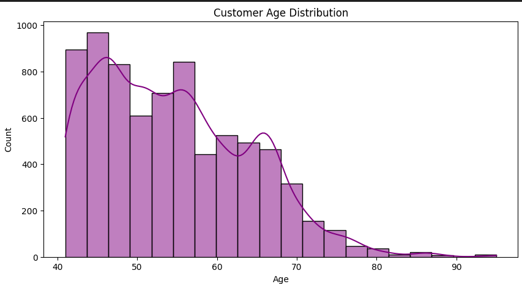
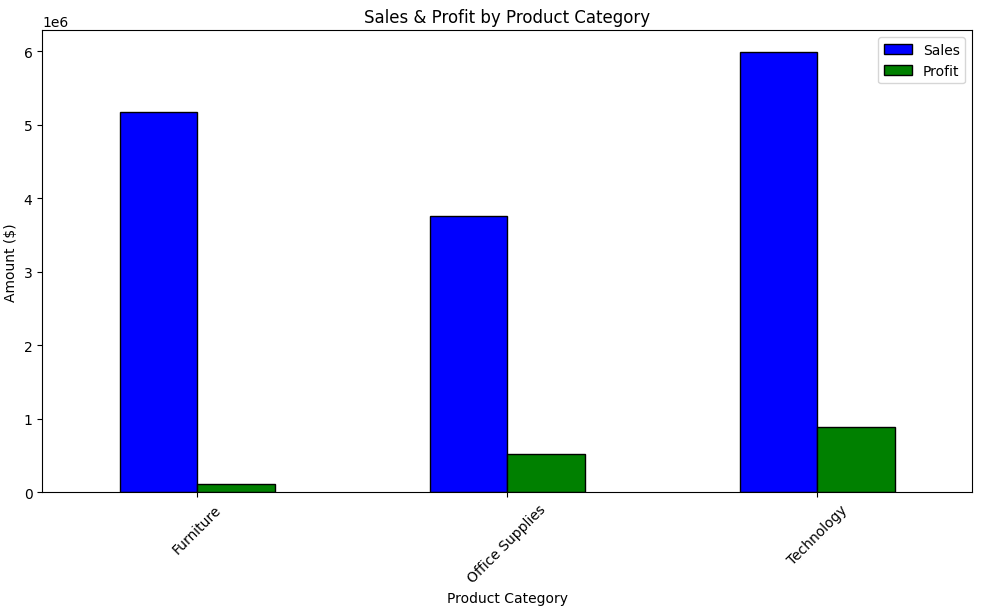
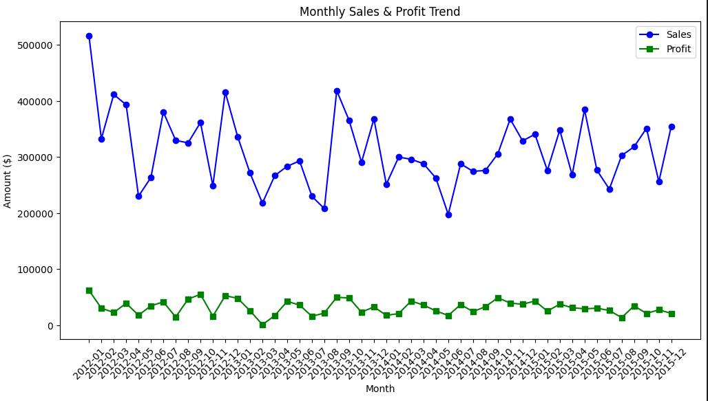

# Insightify

## Overview

Insightify is an Affordable, AI-powered retail analytics tool designed to optimize market survey analysis using **statistical methods** and **LLM-driven insights**. It helps mid-sized businesses and FMCG markets make informed decisions, enhance customer engagement, and improve sales strategies.

## Features

- AI-driven diagnostic and inferential analysis for better decision-making
- Provide detailed Analytics highlighting whats important as well as profitable overlooked product sales
- Manual as well as Hypothesis generation and testing
- Marketing strategies and campaign suggestions

# **Customer Data Analysis Workflow**

## **1️⃣ Data Collection & Preprocessing**
- Import data from databases
- The data must consist of attributes such as:
  - **Customer Information**: `CustomerID`, `Age`, `Gender`, `Income`, `Region`, `Zip Code`
  - **Transaction Details**: `OrderID`, `Order Date`, `Payment Method`, `Order Priority`, `Sales`, `Profit`, `Discount applied`, `Shipping Cost`
  - **Store Details**: `Location`, `Zip Code`, `Foot Traffic`
  - **Product Data**: `ProductID`, `Product Name`, `Product Category`, `Unit Price`, `Profit`, `Stock available`
- Handle missing values, duplicates, and inconsistencies
- Normalize, encode, and engineer new features 

## **2️⃣ Exploratory Data Analysis (EDA)**
- Compute descriptive statistics (mean, variance, correlations)  
- Visualize patterns using histograms, boxplots, and scatterplots  
- Detect and handle outliers  

## **3️⃣ Customer Segmentation & Clustering**
- Apply **K-Means, DBSCAN, Hierarchical Clustering**  
- Use **PCA** for dimensionality reduction  
- Define customer segments based on behavioral patterns  

## **4️⃣ Statistical Analysis & Hypothesis Testing**
- Conduct **ANOVA & T-tests** for group comparisons  
- Use **Regression Analysis** to identify trends  
- Perform **Crosstab & Factor Analysis** for categorical dependencies  

## **5️⃣ Predictive Analytics & Machine Learning**
- Apply **Market Basket Analysis (Apriori Algorithm)**  
- Forecast trends using **Time Series Analysis**  
- Integrate LLMs to generate tailored customer strategies based on the analyzed data

## **6️⃣ Business Strategy Optimization**
- Optimize pricing models using historical data  
- Personalize marketing through RFM segmentation  
- Implement A/B testing for data-driven decision-making  

## **7️⃣ Visualization & Reporting**
- Build **interactive dashboards** (Plotly, Seaborn)  
- Generate **automated reports** with key findings  
- Present insights for **stakeholder decision-making**  

## Project Checklist

### **Statistical & Analytical Techniques**

- [x] **ANOVA** - Statistical differences in customer behavior
- [x] **T-tests** - Comparing means across groups
- [x] **Regression Analysis** - Identifying trends and relationships
- [x] **Cluster Analysis** - Customer segmentation
- [x] **Crosstab Analysis** - Examining relationships between two or more categorical variables to identify patterns and associations
- [x] **Factor Analysis** - Reducing data complexity by identifying underlying factors influencing customer behavior
- [ ] **Time Series Analysis** - Market trend forecasting
- [ ] **Monte Carlo Simulation** - Risk assessment
- [ ] **CLV Analysis** - Measuring customer lifetime value
- [ ] **Apriori Algorithm** - Identifying frequently purchased product combinations to enhance cross-selling and recommendation systems
- [ ] **RFM Analysis** - Segmenting customers based on Recency, Frequency, and Monetary value to optimize targeting strategies
- [ ] **Basket Size Analysis** - Examining customer purchase behavior to increase average transaction value
- [ ] **Price Optimization** - Using data-driven approaches to determine optimal pricing strategies for maximizing revenue and customer satisfaction

### **LLM-Driven Strategy Generation**

- [ ] Generate **personalized marketing strategies**
- [ ] Generate **personalized loyalty and referral programs**
- [ ] Optimize **employee performance tracking and manpower resourcefulness**
- [ ] Predict **churn risks**
- [ ] Swot Analysis

## Deployment & Integration

- [ ] Ensure integration with **POS systems**
- [ ] Automate dashboard generation for insights
- [ ] Implement **AI-powered recommendations**

## Future Enhancements

- [ ] Integration with POS Systems
- [ ] Realtime analysis and strategies performance

## Snapshots

## Tech Stack

- React
- Spring
- Postgres
- Scikit learn
- Seaborn
- Deepseek/Gemini

### Team members

- Advait Yadav
- Shreyash Borde
- Raj Sapale
- Mrudul Pawar
